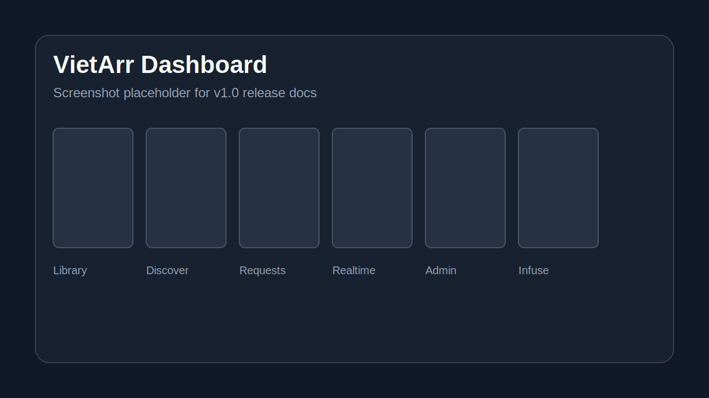

# VietArr

**VI:** Media server tự động cho người Việt: cài stack *arr, Dashboard duyệt thư viện, request phim, realtime progress và phát qua Infuse/SMB.

**EN:** Automated media server for Vietnamese households: install an *arr stack, browse the library, request movies, follow realtime progress, and play through Infuse/SMB.

> Status: pre-1.0 release hardening. See [ROADMAP.md](ROADMAP.md).

## Screenshot



## Quickstart / Cài nhanh

Target OS: Ubuntu 24.04 with Docker available and a writable media root.

```bash
curl -fsSL https://raw.githubusercontent.com/vietarr/vietarr/v1.0.0/installer/install.sh | sudo bash -s -- install
```

Manual checksum path:

```bash
curl -fsSLO https://raw.githubusercontent.com/vietarr/vietarr/v1.0.0/installer/vietarr.sh
curl -fsSLO https://raw.githubusercontent.com/vietarr/vietarr/v1.0.0/installer/vietarr.sh.sha256
sha256sum -c vietarr.sh.sha256
sudo bash vietarr.sh install
```

## What VietArr Includes / VietArr có gì

| Area | VI | EN |
|---|---|---|
| Installer | Cài Docker compose stack và tự nối API key/root folder/download client | Installs the Docker compose stack and wires API keys, root folders, and download clients |
| Core | Express API, SQLite cache, auth, request API, WebSocket realtime, HTTP Range stream | Express API, SQLite cache, auth, request API, WebSocket realtime, HTTP Range stream |
| Web | Dashboard Next.js: thư viện, chi tiết phim, tìm TMDB, request, admin invite | Next.js Dashboard: library, detail pages, TMDB search, requests, admin invites |
| Playback | Infuse deep link, HTTP Range stream, SMB path fallback | Infuse deep links, HTTP Range stream, SMB path fallback |

Fshare Bridge is not part of the v1.0 roadmap. See [ADR-005](docs/decisions/ADR-005-remove-fshare-bridge-from-roadmap.md).

## Requirements / Yêu cầu

- Ubuntu 24.04 host or VM.
- Docker with Compose plugin.
- Media path writable by UID/GID `1000`.
- Internal DNS for `vietarr.home.arpa` or your chosen `DOMAIN_SUFFIX`.
- TMDB API key for discovery.

## Repository Layout / Cấu trúc repo

| Path | Role |
|---|---|
| `installer/` | CLI installer, checksum bootstrap, zero-touch wiring |
| `core/` | VietArr Core API, auth, requests, websocket realtime, stream proxy |
| `web/` | Next.js Dashboard |
| `docs/` | API, design system, block specs, ADRs |
| `.github/` | CI, release workflow, issue templates |

## Documentation / Tài liệu

- [ARCHITECTURE.md](ARCHITECTURE.md) — architecture overview.
- [ROADMAP.md](ROADMAP.md) — phase-gated roadmap.
- [docs/API.md](docs/API.md) — Core API contract.
- [docs/GLOSSARY.md](docs/GLOSSARY.md) — Vietnamese UI terms.
- [SECURITY.md](SECURITY.md) — secret handling and vulnerability reporting.

## Development / Phát triển

```bash
cd core && npm ci && npm test
cd web && npm ci && npm run lint && npm run build
```

Block contracts are phase-gated. Read [AGENTS.md](AGENTS.md) and the active block spec before changing behavior.
